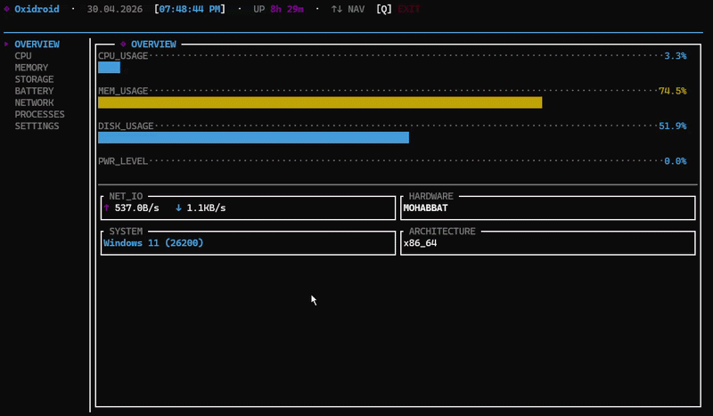

# Oxidroid


**Oxidroid** is a fast, polished Terminal User Interface (TUI) system monitor built in Rust. Originally created for Android via Termux, it now runs smoothly on Linux and Windows too.



## Highlights

* **Zero-Configuration Native Execution:** Custom-built binaries for Termux (Bionic libc), Linux (musl static), and Windows. No missing library errors.
* **Modern Aesthetic:** Clean, responsive layout with a sharp, anime-inspired vibe.
* **High Performance:** Rust-powered efficiency for low overhead and responsive updates.
* **Cross-Platform:** Monitor your phone, your desktop, or your server with the exact same tool.

---

## Installation

Oxidroid is distributed as a single, standalone binary. Download the correct file for your OS, then run it using the appropriate commands below.


### The Universal Way 

```bash
git clone https://github.com/Andrew-Velox/Oxidroid.git
cd Oxidroid
cargo build --release
```

### Android (Termux)
Install Termux and Termux:API from F-Droid before proceeding:

- Download **Termux**: [F-Droid Link](https://f-droid.org/packages/com.termux/)
- Download **Termux:API**: [F-Droid Link](https://f-droid.org/packages/com.termux.api/) (~3.8 MiB)

Install dependencies:
```bash
pkg install wget termux-api -y
```

Download the binary:
```bash
wget -O $PREFIX/bin/oxidroid https://github.com/Andrew-Velox/Oxidroid/releases/download/v0.1.8/oxidroid-android-aarch64
chmod +x $PREFIX/bin/oxidroid
hash -r
oxidroid
```

### Linux (Desktop / Server)
Download the binary:
```bash
wget https://github.com/Andrew-Velox/Oxidroid/releases/download/v0.1.8/oxidroid-linux-x86_64
chmod +x oxidroid-linux-x86_64
./oxidroid-linux-x86_64
```

### Windows
Download the binary:
```powershell
Invoke-WebRequest -Uri "https://github.com/Andrew-Velox/Oxidroid/releases/download/v0.1.8/oxidroid-windows.exe" -OutFile "oxidroid.exe"
.\oxidroid.exe
```
*(Note: Windows SmartScreen may flag the `.exe` since it is a new open-source binary. Click "More info" -> "Run anyway").*

---

## Usage

Once installed, run:
```bash
oxidroid
```

## Keybindings

| Key | Action |
|-----|--------|
| `↑` / `↓` | Navigate tabs |
| `Tab` | Next tab |
| `Enter` | Open file explorer (Storage tab) |
| `Esc` | Close file explorer |
| `←` / `→` | Adjust setting value (Settings tab) |
| `r` | Reset settings to defaults |
| `q` | Quit |

---

<!-- ## Contributing

Contributions, issues, and feature requests are always welcome!

1. **Fork** the project.
2. **Create** your feature branch: `git checkout -b feature/AmazingFeature`
3. **Commit** your changes: `git commit -m 'Add some AmazingFeature'`
4. **Push** to the branch: `git push origin feature/AmazingFeature`
5. **Open** a Pull Request. -->

<!-- --- -->


