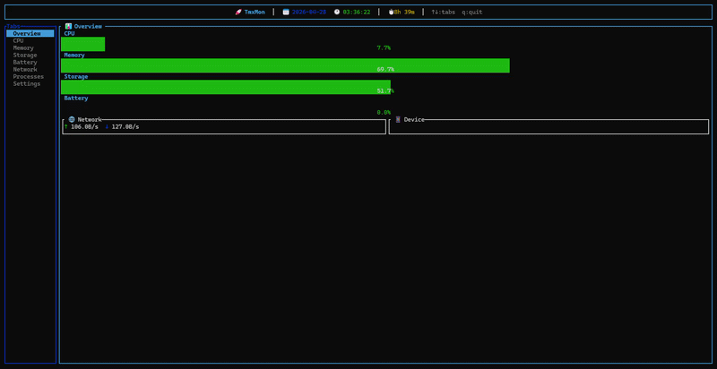

# 🚀 TmxMon



A blazingly fast, modern TUI system monitor originally built for Termux — rewritten in Rust using `ratatui`. 

While optimized for Android hardware environments, TmxMon features graceful native fallbacks, making it a fully cross-platform monitoring dashboard for Windows and Linux desktops as well.

## ✨ Features
- **Overview** — CPU, Memory, Storage, Battery gauges + Network speed + Device info
- **CPU** — Overall + per-core gauges, model, and live frequency stats
- **Memory** — RAM & Swap gauges with detailed usage breakdown
- **Storage** — Disk usage + built-in interactive file explorer
- **Battery** — Charge level, status, health, temperature, and current 
- **Network** — Live upload/download speed, IP, and total data transferred
- **Processes** — Top 20 processes sorted by live CPU usage
- **Settings** — Adjustable refresh rate & battery capacity configs

## 🛠️ Install & Build

```bash
# Install dependencies (Termux)
pkg install rust git

# Clone and run
git clone https://github.com/Andrew-Velox/TmxMon.git
cd TmxMon
cargo run --release
```

## ⌨️ Keybindings

| Key | Action |
|-----|--------|
| `↑` / `↓` | Navigate tabs |
| `Tab` | Next tab |
| `Enter` | Open file explorer (Storage tab) |
| `Esc` | Close file explorer |
| `←` / `→` | Adjust setting value (Settings tab) |
| `r` | Reset settings to defaults |
| `q` | Quit |

## 📦 Dependencies
- `ratatui` — TUI framework
- `crossterm` — Terminal control
- `sysinfo` — Core system info gathering
- `chrono` — Date/time formatting
- `anyhow` — Error handling

## 📝 Notes
- **Android:** Battery info requires `termux-battery-status` (install via the `termux-api` package). Device info requires standard Android `getprop`.
- **Desktop:** On Windows and Linux, TmxMon automatically bypasses Termux dependencies and uses native WMI/sysfs to read hardware and battery data.